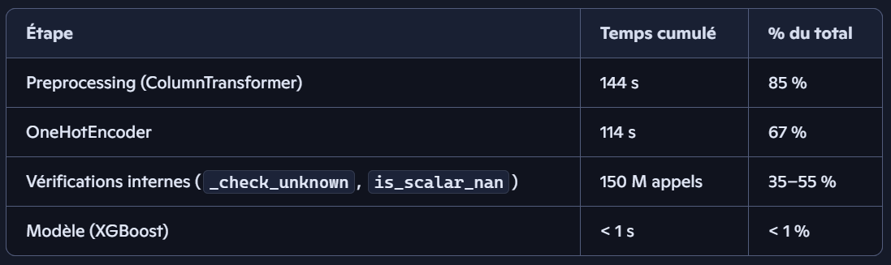
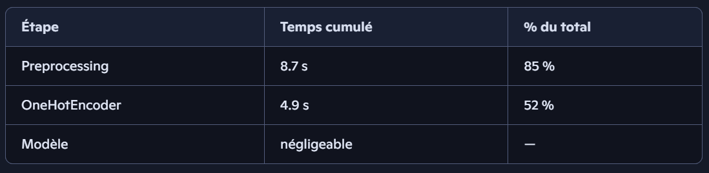
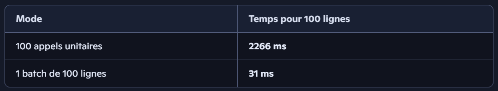

# Classification Risque Crédit - Pipeline MLOps

## Contexte
L’entreprise souhaite mettre en place un système automatisé de scoring crédit capable :
- d’estimer la probabilité de défaut d’un client,
- de classer automatiquement une demande en crédit accordé ou crédit refusé,
- tout en garantissant transparence et industrialisation du cycle de vie du modèle.

Ce projet s’inscrit dans une démarche MLOps complète, du tracking d’expérimentations jusqu’au serving du modèle.

## Objectifs du projet

Ce projet a pour objectif principal de **construire et optimiser un modèle de scoring prédictif du risque de défaut**.

Autrement dit, il faudra:
- Analyser les variables explicatives:
    - Feature importance globale
    - Explicabilité locale (niveau client)

- Implémenter une démarche MLOps complète:
    - Tracking des expérimentations
    - Model Registry
    - Serving

- Optimiser un score métier prenant en compte:
    - Le déséquilibre de classes
    - Le coût asymétrique des erreurs (FN = 10 × FP)

- Comparer plusieurs modèles via Cross-Validation et GridSearch.

## Sources de données


Nous avons reçu des données provenant de sources multiples:
- Socio‑démographiques
- Historiques de crédit
- Comportements de paiement
- Interactions avec d’autres institutions

## Nettoyage structurel des données

Avant toute modélisation, un nettoyage approfondi a été réalisé pour garantir la qualité des données :

**1. Harmonisation des types**
- Conversion des dates en format datetime
- Uniformisation des variables catégorielles
- Correction des types numériques (float/int)

**2. Préparation des valeurs manquantes & outliers**

L’objectif ici n’est pas de *“nettoyer à la main”*, mais de préparer les données pour qu’elles soient
traitées de manière systématique dans le pipeline MLOps, sans logique ad hoc.

**3. Nettoyage structurel**
- Harmonisation des noms de varibales et modifications des formats
- Suppression des colonnes constantes ou quasi‑constantes
- Suppression des identifiants non pertinents
- Vérification des doublons
- Fusion des tables <> obtenir un seul historique complet des comportements des clients.

## Feature Engineering

Pour chaque client, des agrégations (*min, max, mean, count, sum*) ont été calculées sur les tables.

Concernant les colonnes crées, nous avons choisi d'intéger des varialbles majoritairement liées au comportement réel de remboursement du crédit:
- **PAYMENT_DELAY**: retard réel vs prévu
- **LATE_PAYMENT**: indicateur de retard
- **PARTIAL_PAYMENT**: paiement incomplet
- **EARLY_PAYMENT**: paiement anticipé
- **PAYMENT_RATIO**: montant payé / montant
- **UTILIZATION**: utilisation du crédit
PAYMENT_RATIO : ratio paiement / retraits


## Analyse exploratoire — Conclusions clés
L’analyse exploratoire a permis d’identifier plusieurs signaux forts sur le profil des *mauvais payeurs*:

**1. Variables socio‑démographiques**
- Revenus faibles présentent un taux de défaut plus élevé
- Les célibataires et divorcés sont plus à risque
- Les niveaux d’éducation inférieurs sont associés à un risque accru

**2. Historique de crédit**
- Les clients ayant déjà eu des retards plus risqués
- La capacité de remboursement du client est un des indicateurs forts
- Un ratio payé/dû traduisant des paiements irréguliers.

**3. Comportement de paiement**
- Les refus antérieurs sont très prédictifs
- Les nouveaux clients sont plus incertains
- Les retards successifs sont très discriminants

## Approche Machine Learning Operations (**MLOps**)

Le projet suit une démarche MLOps complète :

**1. Tracking des expérimentations (MLflow)**
- Suivi des hyperparamètres
- Suivi des métriques (AUC, recall, coût métier)
- Versioning des modèles
- Export des artefacts (ROC, CM, SHAP)

**2. Organisation des experiments**
- Baseline
- Feature engineering
- Traitement des outliers
- Optimisation des hyperparamètres
- Sélection du meilleur modèle via coût métier

**3. Reproductibilité**
- Environnement Conda versionné
- Scripts d’entraînement reproductibles
- Artefacts exportés dans *artefacts/*

Le projet repose donc sur une approche MLOps qui répond à ce schéma:


**Préprocessings initiaux** 
- un ***modèle de base***, puis 
- un ***modèle optimisé***, via une recherche d’hyperparamètres (RandomizedSearchCV)
pour chaque preprocessing constituant une branche indépendante & testée de manière équitable.

Les processings initiaux sont:
- **Missing Flag**: conserver les valeurs manquantes en les rendant explicites
- **Imputation**: remplacer les valeurs manquantes par des statistiques adaptées
- **Drop70**: supprimer les variables trop incomplètes pour réduire le bruit

**Nettoyage des outliers**
Etape transversale pour mesurer l’impact réel du nettoyage des valeurs aberrantes sur chaque preprocessing.

**Transformation des colonnes**
- **StandardScaler** sur les variables numériques,
- **OneHotEncoder** sur les variables catégorielles nominales,
- **TargetEncoder** sur les variables catégorielles à forte cardinalité.

**Entraînement**
Chaque pipeline complet est évalué selon trois axes :
- **Coût métier**: critère principal, basé sur le coût des faux positifs et faux négatifs
- **Seuil optimal**: déterminé pour minimiser le coût global.
- **Métriques classiques**: AUC, recall, precision, F1, etc.

Le modèle final est celui qui obtient le **coût métier minimal**, toutes expériences confondues.

## Sélection du meilleur modèle

Plusieurs modèles ont été testés allant du plus simple (*régression logistique*) au plus avancé (*XGBoost*). Le *Dummy* sert de référence, la *régression logistique* est interprétable mais limitée, le *Random Forest* capturent les relations complexes, et *XGBoost* offre le meilleur compromis entre performance et robustesse.


**Critère principal: coût métier = ```10 x FN + 1 x FP```**

**Modèle retenu: XGBoost optimisé**

| Résultats	| Valeurs	|
|-----------|-----------|
| AUC | **0.78** |
| Recall mauvais payeurs | **67%** |
| Coût métier minimal | **30 629 €** |
| Seuil optimal | **0.5** |
| | |

Le modèle permet:

- d’identifier 3319 mauvais payeurs sur 4965

- de réduire les faux négatifs (erreurs les plus coûteuses)

- de maintenir un bon équilibre entre détection du risque et acceptation des bons clients.


## Feature Importance & Explicabilité (**SHAP**)

**Variables les plus influentes**

- Scores externes de solvabilité
- Historique de crédit
- Retards de paiement
- Refus antérieurs
- Ratios de paiement (installments)


**Explicabilité locale**
Pour chaque client, les valeurs SHAP permettent d’expliquer:
- Pourquoi le score augmente
- Pourquoi le score diminue
- Quelles variables influencent le plus la décision


## Prédictions finales

Le modèle retenu (*XGBoost optimisé*) a été appliqué à un jeu de données inédit, non utilisé lors de l’entraînement.

L’objectif est d’évaluer son comportement en conditions réelles et de produire une décision de crédit automatisée.


Cette forte proportion de refus est cohérente avec:

- le seuil optimal choisi pour maximiser le rappel des mauvais payeurs,
- la distribution naturellement risquée du dataset,
- la stratégie volontairement conservatrice du modèle (réduire les FN).

## CI/CD et Déploiement

Ce projet met en œuvre une approche CI/CD complète, séparant:
- l’intégration continue (**CI**): garantir la qualité du code
- le déploiement continu (**CD**): rendre l’API accessible publiquement

## Optimisation du modèle & API (MLOps)
Cette dernière partie du projet vise à assurer la **robustesse**, la **scalabilité** et la **fiabilité** du modèle en production.  
Elle repose sur trois piliers :

- **Collecte & stockage des données de production**
- **Monitoring du drift & des métriques système**
- **Optimisation du pipeline de prédiction (profiling & batch)**

### 1. Collecte & stockage des données de production

Chaque appel à l’API génère un log structuré contenant:
- les données d’entrée du client,
- le score prédit,
- la décision (accord/refus),
- la latence totale,
- la latence d’inférence,
- l’état CPU/RAM au moment de la requête.

Ces logs sont écrits en **JSON Lines** (`predictions_logs.jsonl`) pour permettre:
- un append efficace,
- une lecture ligne par ligne,
- une compatibilité avec les outils Big Data.

Exemple d’une ligne de log:
```json
{
  "timestamp": "...",
  "latency_ms": 104.2,
  "inference_ms": 36.7,
  "cpu_percent": 24.0,
  "ram_percent": 74.2,
  "prediction": 0.87,
  "decision": "refus"
}
````
Pour faciliter l’analyse, les logs sont ensuite convertis en Parquet, un format colonne‑orienté plus compact, plus rapide à charger, & idéal pour les analyses statistiques.

### 2. Monitoring du drift & des métriques système

Les données de production sont comparées aux données de référence via Evidently AI.

- **Harmonisation préalable**

Avant toute comparaison, les colonnes sont alignées (mêmes noms, mêmes types), nettoyées, synchronisées entre référence et production.

- **Résultats du drift global (dataset complet)**
    - **Colonnes analysées: 278**
    - **Colonnes en dérive: 79**
    - **Taux de dérive: 28.4 %**

Ce taux s’explique par des changements de distribution sur les montants, des catégories rares apparaissant en production, des comportements de paiement différents.

- **Résultats sur l’échantillon (500 lignes)**
    - **Colonnes analysées: 275**
    - **Colonnes en dérive: 18**
    - **Taux de dérive: 6.5 %**

Cette différence est normale: un petit échantillon lisse les distributions et réduit la puissance statistique des tests.

- **Dashboard Streamlit**
````python
streamlit run Monitoring/dashboard.py
````
Un dashboard interactif permet de visualiser:
- le drift par colonne,
- les distributions ref vs prod,
- les métriques système (CPU, RAM, latence),
- les anomalies de production,
- l'mpact de l'optimisation.

Ce dashboard constitue un outil essentiel pour le monitoring continu.

### 3. Optimisation du pipeline de prédiction
L’objectif est d’identifier les goulots d’étranglement du pipeline et d’optimiser la latence de l’API.

- **Profiling du pipeline (dataset complet)**
Le profiling montre que:


**Le modèle est très rapide. Le preprocessing est le vrai goulot d’étranglement.**

- **Profiling sur échantillon (500 lignes)**


Le comportement reste identique, mais les temps absolus chutent fortement.

- **Appels unitaires vs batch**


Le batch est 73× plus rapide que l’unitaire.

Le preprocessing est vectorisé : il ne s’exécute qu’une seule fois en batch.

Au vu des résultats:
- optimiser le modèle n’aurait apporté qu’un gain marginal (2–3 ms),
- optimiser le preprocessing permet de gagner plusieurs secondes en unitaire,
- le batch permet de réduire la latence d’un facteur ×70.

**Décision: optimiser le preprocessing et le mode d’appel, pas le modèle.**